

    <h1 style="display: inline-flex; align-items: center;">
        Awesome LLMs for 3D Scene Understanding
    </h1>

This repository manually collects works in LLM based **3D Scene Understanding**, which will be continuously updated.

## 📖 News
**[2025/12/18]** We release the initial version!

## 🌟 Overview
Here, we classify all the 3D Scene Understanding based methods three categories, and sort by date in ascending order:
- [📖 News](#-news)
- [🌟 Overview](#-overview)
- [🗒️ Tasks](#-tasks)
- [🔥 Methods](#-methods)
  - [Offline Scene Understanding](#Offline-Scene-Understanding)
    - [2D Input](#2D-Input)
    - [3D Input](#3D-Input)
    - [2D+3D Input](#2D+3D-Input)
  - [Incremental Scene Understanding](#Incremental-Scene-Understanding)
    - [2D Input](#2D-Input)
    - [3D Input](#3D-Input)
    - [2D+3D Input](#2D+3D-Input)
  - [Dynamic Scene Understanding](#Dynamic-Scene-Understanding)
    - [2D Input](#2D-Input)
    - [3D Input](#3D-Input)
    - [2D+3D Input](#2D+3D-Input)
- [🤝 Contributing](#-contributing)

## 🗒️ Tasks

### Visual Grounding Task
| Benchmark Name | Paper Title | Examples | Dataset |
|---------------|----------------------------------------------------------------------------------------------------------------------------------------------------------------------------------------------------------------|---------------------------------------------------------------------|--------------------------------------------------------------------------------------------|
| ScanRefer |    [ScanRefer: 3D Object Localization in RGB-D Scans using Natural Language.](https://arxiv.org/abs/1912.08830)                                                                           |     --      | [HF]()                                    |
| Multi3drefer |    [Multi3drefer: Grounding text description to multiple 3d objects. ](https://arxiv.org/abs/2309.05251)                                                                           |     --      | [HF](https://huggingface.co/datasets/3dlg-hcvc/Multi3DRefer)                                    |

### 2D Spatial Question Answering
| Benchmark Name | Paper Title | Examples | Dataset |
|---------------|----------------------------------------------------------------------------------------------------------------------------------------------------------------------------------------------------------------|---------------------------------------------------------------------|--------------------------------------------------------------------------------------------|
| OpenEQA |   [Openeqa: Embodied question answering in the era of foundation models.](https://open-eqa.github.io/assets/pdfs/paper.pdf) | -- | [Github](https://open-eqa.github.io/) |

### Scene Description
| Benchmark Name | Paper Title | Examples | Dataset |
|---------------|----------------------------------------------------------------------------------------------------------------------------------------------------------------------------------------------------------------|---------------------------------------------------------------------|--------------------------------------------------------------------------------------------|
| Scan2Cap |    [Scan2Cap: Context-aware Dense Captioning in RGB-D Scans.](https://arxiv.org/abs/2012.02206)                                                                           |     --      | [HF]()                                    |

### 3D Visual Question Answering
| Benchmark Name | Paper Title | Examples | Dataset |
|---------------|----------------------------------------------------------------------------------------------------------------------------------------------------------------------------------------------------------------|---------------------------------------------------------------------|--------------------------------------------------------------------------------------------|
| ScanQA |    [ScanQA: 3D Question Answering for Spatial Scene Understanding.](https://arxiv.org/abs/2112.10482)                                                                           |     --      | [HF]()                                    |
| SQA3D |    [SQA3D: Situated Question Answering in 3D Scenes.](https://arxiv.org/abs/2210.07474)                                                                           |     --      | [Zenodo](https://zenodo.org/records/7792397#.ZCkprfFBx3g)                                    |
| MV-ScanQA |    [Advancing 3D Scene Understanding with MV-ScanQA Multi-View Reasoning Evaluation and TripAlign Pre-training Dataset.](https://arxiv.org/abs/2508.11058)                                                                           |     --      | [Github](https://matthewdm0816.github.io/tripalign-mvscanqa/)                                    |

### Explore Question Answering
| Benchmark Name | Paper Title | Examples | Dataset |
|---------------|----------------------------------------------------------------------------------------------------------------------------------------------------------------------------------------------------------------|---------------------------------------------------------------------|--------------------------------------------------------------------------------------------|
| GOAT-Bench |    [GOAT-Bench: A Benchmark for Multi-modal Lifelong Navigation.](https://arxiv.org/abs/2404.06609) |     --      | [Github](https://github.com/Ram81/goat-bench?tab=readme-ov-file#floppy_disk-dataset) |
| A-EQA(subset of OpenEQA) |   [Openeqa: Embodied question answering in the era of foundation models.](https://open-eqa.github.io/assets/pdfs/paper.pdf) | -- | [Github](https://open-eqa.github.io/) |
| EXPRESS-Bench | [Beyond the Destination: A Novel Benchmark for Exploration-Aware Embodied Question Answering](https://arxiv.org/abs/2503.11117) |  --      | [Github](https://github.com/HCPLab-SYSU/EXPRESS-Bench) |
| EQA-RT | [ToolEQA Multi-Step Reasoning for Embodied Question Answering via Tool Augmentation](https://arxiv.org/abs/2510.20310) |  --      | [Github](https://github.com/ToolEQA/ToolEQA) |

## Related Survey
[When LLMs step into the 3D World: A Survey and Meta-Analysis of 3D Tasks via Multi-modal Large Language Models](https://arxiv.org/abs/2405.10255)

## 🔥 Methods

### Offline Scene Understanding

#### 2D-Input
| Date    | Paper Title                                                                                                                                                                                                    | Introduction                                                        | Code                                                                                       |
|---------|----------------------------------------------------------------------------------------------------------------------------------------------------------------------------------------------------------------|---------------------------------------------------------------------|--------------------------------------------------------------------------------------------|
| 2025/05 |    [Boosting MLLM Capabilities in Visual-based Spatial Intelligence](https://arxiv.org/abs/2506.01946)                                                                           | 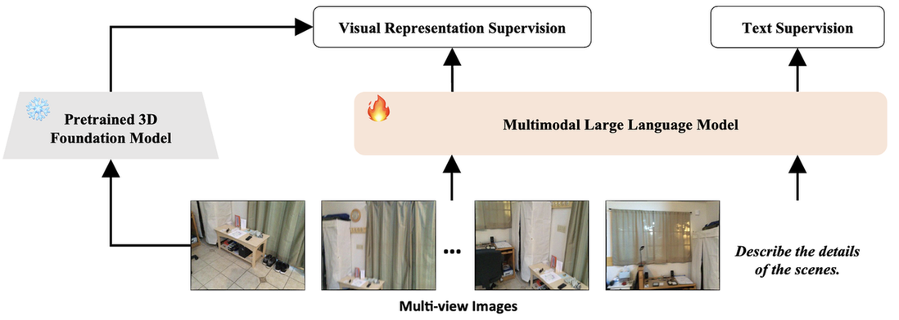          | [Github](https://github.com/Visual-AI/3DRS)  |   
| 2025/05 |    [Spatial-MLLM: Boosting MLLM Capabilities in Visual-based Spatial Intelligence](https://arxiv.org/abs/2505.23747)                                                                           | 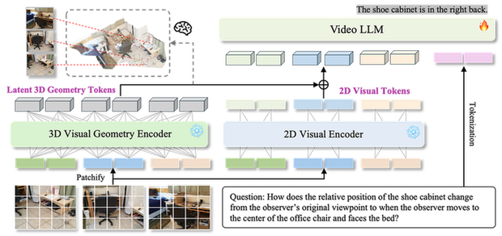          | [Github](https://github.com/LaVi-Lab/VG-LLM) |
| 2025/05 |    [Boosting MLLM Capabilities in Visual-based Spatial Intelligence](https://arxiv.org/abs/2505.24625)                                                                           | 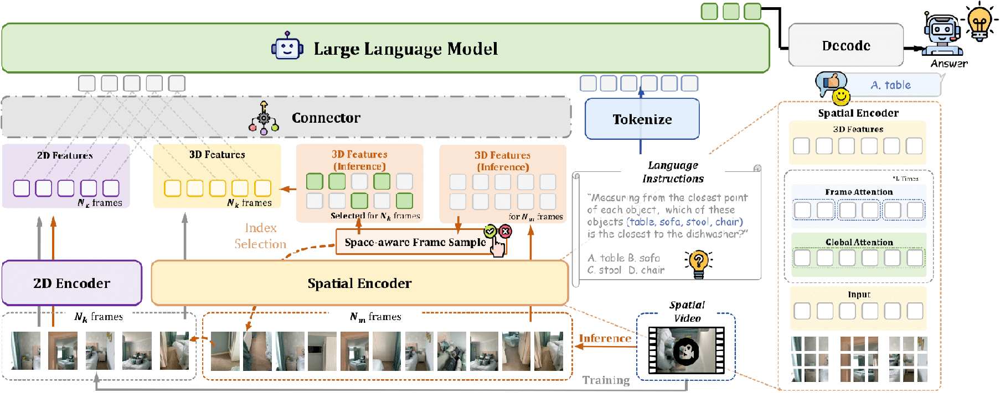          | [Github](https://github.com/diankun-wu/Spatial-MLLM)                                    |
                               

#### 3D-Input
| Date    | Paper Title                                                                                                                                                                                                    | Introduction                                                        | Code                                                                                       |
|---------|----------------------------------------------------------------------------------------------------------------------------------------------------------------------------------------------------------------|---------------------------------------------------------------------|--------------------------------------------------------------------------------------------|

#### 2D+3D-Input
| Date    | Paper Title                                                                                                                                                                                                    | Introduction                                                        | Code                                                                                       |
|---------|----------------------------------------------------------------------------------------------------------------------------------------------------------------------------------------------------------------|---------------------------------------------------------------------|--------------------------------------------------------------------------------------------|
| 2023/12 |    [Chat-Scene: Bridging 3D Scene and Large Language Models with Object Identifiers](https://arxiv.org/abs/2312.08168)                                                                           | 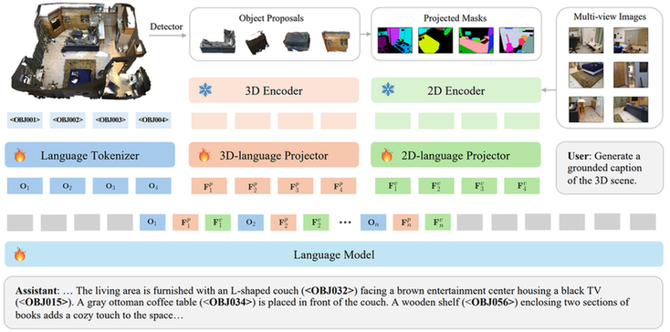          | [Github](https://github.com/ZzZZCHS/Chat-Scene)                                    |
| 2024/12 |    [3DGraphLLM: Combining Semantic Graphs and Large Language Models for 3D Scene Understanding](https://arxiv.org/abs/2412.18450)                                                                           | 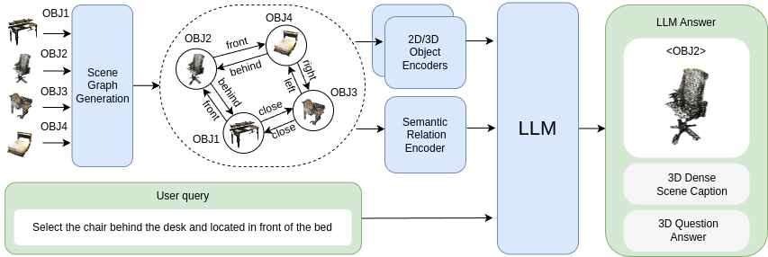          | [Github](https://github.com/CognitiveAISystems/3DGraphLLM)                                    |
| 2025/01 | [GPT4Scene: Understand 3D Scenes from Videos with Vision-Language Models](https://arxiv.org/abs/2501.01428)                                                                           | 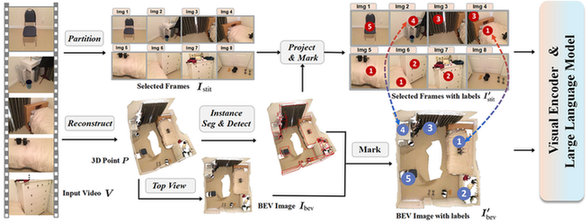          | [Github](https://github.com/Qi-Zhangyang/GPT4Scene-and-VLN-R1)                                    |
| 2025/03 |    [UniVLG: Unifying 2D and 3D Vision-Language Understanding](https://arxiv.org/abs/2503.10745)                                                                           | 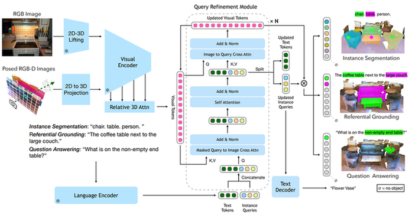          | [Github](https://github.com/facebookresearch/univlg)                                    |
| 2025/05 |    [3DLLM-Mem: Long-Term Spatial-Temporal Memory for Embodied 3D Large Language Model](https://arxiv.org/abs/2505.22657)                                                                           | 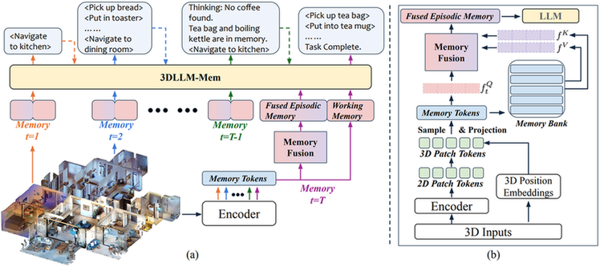          | --                                    |
| 2025/07 | [3D-R1: Enhancing Reasoning in 3D VLMs for Unified Scene Understanding](https://arxiv.org/abs/2507.23478)                                                                           |           | [Github](https://github.com/AIGeeksGroup/3D-R1) |
| 2025/12 | [SNOW: Spatio-Temporal Scene Understanding with World Knowledge for Open-World Embodied Reasoning](https://arxiv.org/abs/2512.16461)                                                                           | 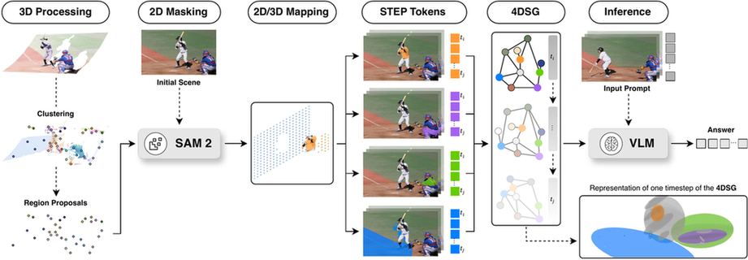          | [Github](https://github.com/AIGeeksGroup/3D-R1) |

### Incremental Scene Understanding
#### 2D-Input
| Date    | Paper Title                                                                                                                                                                                                    | Introduction                                                        | Code                                                                                       |
|---------|----------------------------------------------------------------------------------------------------------------------------------------------------------------------------------------------------------------|---------------------------------------------------------------------|--------------------------------------------------------------------------------------------|

| 2024/10 |    [EfficientEQA: An Efficient Approach to Open-Vocabulary Embodied Question Answering](https://arxiv.org/abs/2410.20263) | 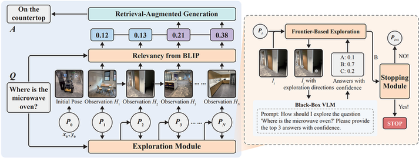 | --   |
| 2025/12 | [MomaGraph: State-Aware Unified Scene Graphs with Vision-Language Model for Embodied Task Planning](https://arxiv.org/abs/2512.169) | 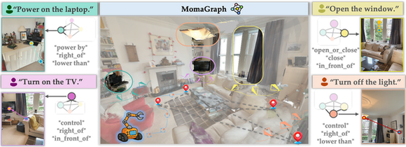          | --   |

#### 2D+3D-Input
| Date    | Paper Title                                                                                                                                                                                                    | Introduction                                                        | Code                                                                                       |
|---------|----------------------------------------------------------------------------------------------------------------------------------------------------------------------------------------------------------------|---------------------------------------------------------------------|--------------------------------------------------------------------------------------------|

| 2024/11 |    [3D-Mem: 3D Scene Memory for Embodied Exploration and Reasoning](https://arxiv.org/abs/2411.17735)  | 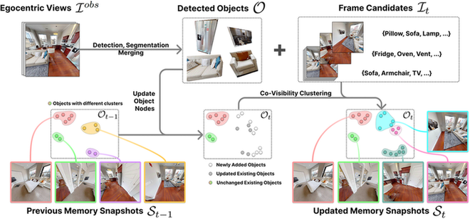          | [Github](https://github.com/UMass-Foundation-Model/3D-Mem) |
| 2025/10 |  [Multi-Step Reasoning for Embodied Question Answering via Tool Augmentation](https://arxiv.org/abs/2510.20310)  | 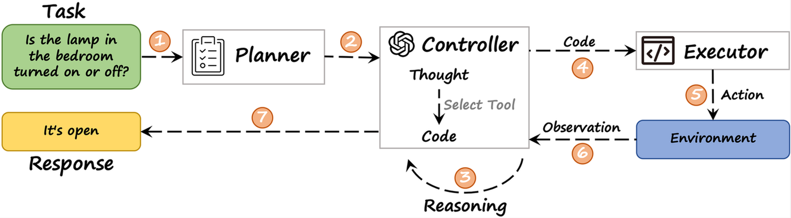          | [Github](https://github.com/ToolEQA/ToolEQA) |
| 2025/11 |  [Expand Your SCOPE: Semantic Cognition over Potential-Based Exploration for Embodied Visual Navigation](https://arxiv.org/abs/2511.08935)  | 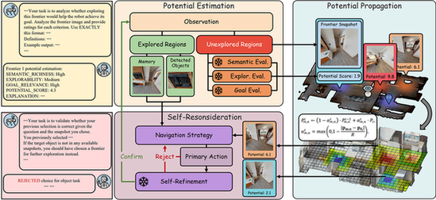          | [Github](https://github.com/mrwangyou/SCOPE) |

### Dynamic Scene Understanding

## 🤝 Contributing
We warmly welcome contributions of excellent resources you find via **pull request**. Please follow the instruction in **CONTRIBUTING.md** if you want to make one.
Additionally, if you want to have any other issue, please add this wechat group.